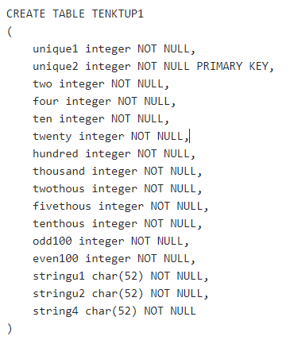
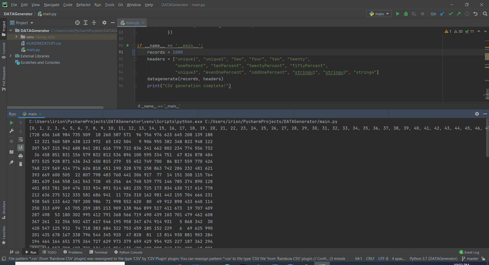
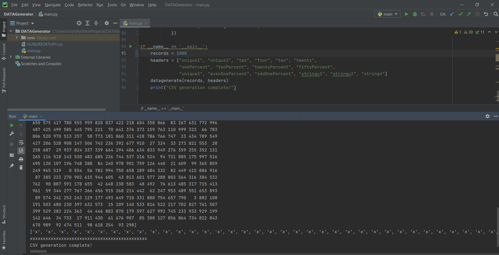
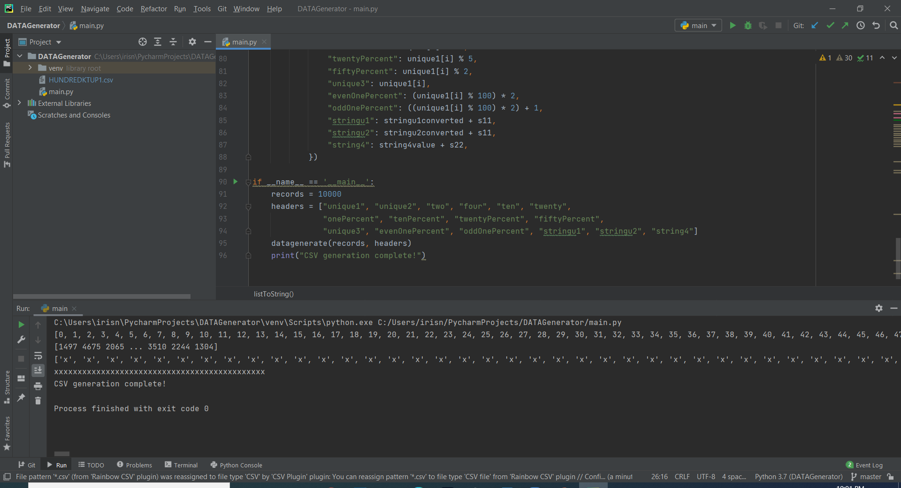
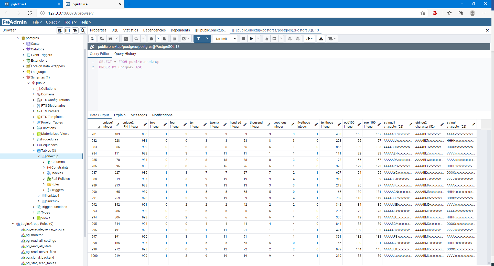
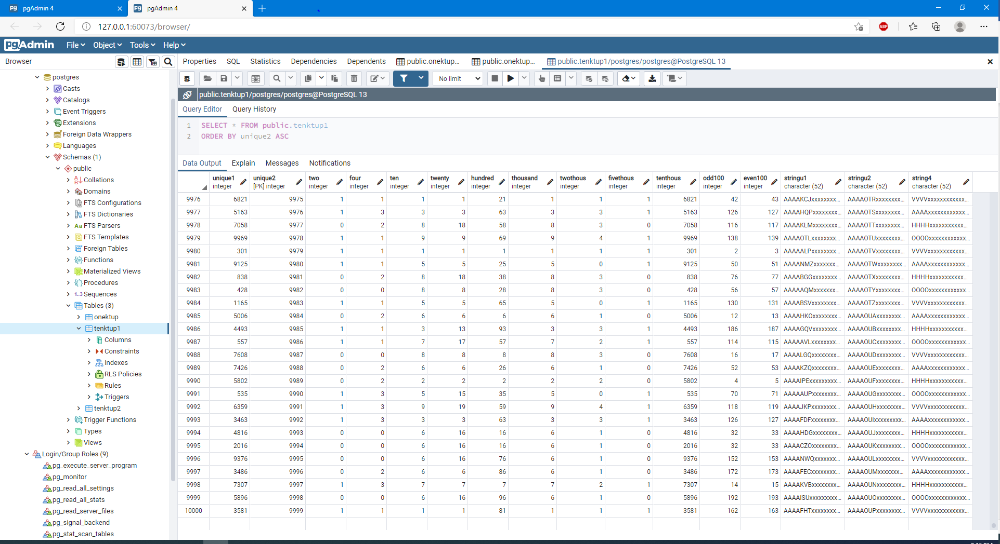
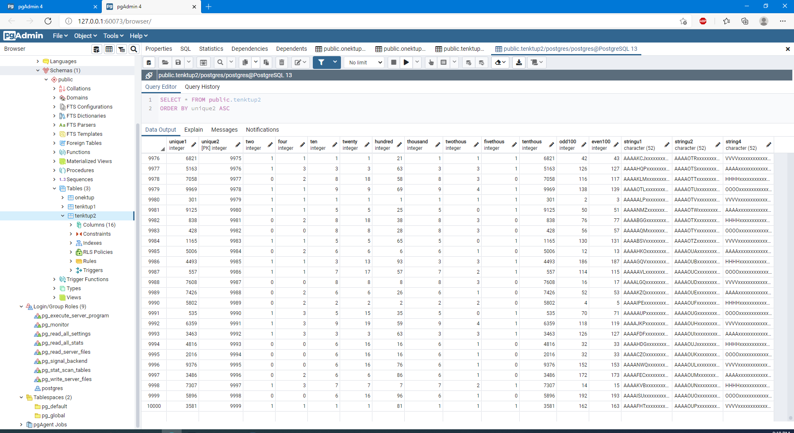

# DBImplementation Wisconsin Benchmark

### Project Contributors:
    Yan Li & Minjin Enkhjargal
 
### Introduction
    
The main purpose of the project is to evaluate a single ‘relational’ system by changing parameters and varying relation sizes. In this project, Wisconsin benchmark data was generated and loaded into a database system. As a result, we generated three tables; one with 1000 tuples (called Onektup) and the other two contained 10000 tuples each (called Tenktup1 and Tenktup2). 

### Description
The data was generated using Neha’s python scripted program for extracting scalable Wisconsin Benchmark data.  The program converted the three sets of data, the 1K and two 10K, into csv files. Furthermore, they were moved into the “script” folder under the PostgreSQL folder. 

The process of loading the csv files into the pgAdmin database required the following commands. 
1. Create the Wisconsin Benchmark Table with its 16 attributes

    

2. Write a SQL statement to load the csv files into the table

    ```COPY public. "tenktup1" FROM 'C:\Program Files\PostgreSQL\13\scripts\Tenktup1.csv' csv HEADER; ```

3. The table should be created and confirmed with the view data icon in the PostgreSQL.


### System Information 
For the system selection, we chose to use PostgreSQL. PostgreSQL is one of the most frequently used relational database management systems by developers today. While we have basic knowledge about this system, we wish to further learn about and evaluate the system by using different parameters. 

### Generate & Load Data into System

***```Display snippets of the Onektup Table```***





***```Display part of the Tenktup1 Table```***




***```Display the Onektup Table from pgAdmin```***




***```Display the Tenktup1 Table from pgAdmin```***




***```Display the Tenktup2 Table from pgAdmin```***




### Lessons and Issues 

We’ve encountered many challenges along the way, but we enjoyed the learning process.

***Issues:***
 - **pgAdmin 4 would not start up or load:** Some technological issues we ran into were while downloading PostgreSQL and running pgAdmin 4. After downloading a missing a registry key and re-installing the system, pgAdmin 4 was able to start up. 
 - **Permission error:** While creating tables and attempting to upload the csv files, pgAdmin 4 gave a folder access permission error. We found only one fix that worked for us. By placing .cvs files into the PostgreSQL program file folder. [ i.e. C:\Program Files (x86)\PostgreSQL\10\scripts ]
 - **Data generation issues:** We downloaded a Wisconsin Benchmark data generator from the internet to get started first. In addition, we were able to generate csv files by implementing some codes in the generator. However, we were unable to load data from the csv files into the PostgreSQL due to two errors which were pgAdmin folder access permission and invalid byte sequence. Later, the issue was resolved after a conversation with Neha. The issue was found to be that the data was not scalable, no header and had extra new lines. Eventually, Neha kindly shared her python script for generating the benchmark data with us. 

***Lessons:***
 - Generate benchmark data. Initially, we used a program to generate data, but it was not scalable. We later fixed the issue by using a python program that was scalable and could generate all the different data.
 - Was able to successfully set up the system using PostgreSQL and get the initial data set loaded into the system

## Google Platform & Setting up PostgreSQL on Compute Engine

1. ***```Google Platform project created and VM instance set up```***


2. Install PostgreSQL on VM. Firewall rule was created to enable traffic. Set up information found at the following link:
`sudo apt -y install postgresql postgresql-client postgresql-contrib`
`https://cloud.google.com/community/tutorials/setting-up-postgres`

3. ***```Connect to PostgreSQL from VM```***


